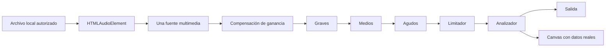

# Ampliación avanzada de Sonaris

Se extiende Sonaris existente, sin sustituir la arquitectura, las listas dobles ni los siete patrones originales. No se añadieron dependencias de producción ni bibliotecas de visualización. Command se incorpora como octavo patrón funcional. Código/comentarios en inglés, controles y documentación en español.

## Diez funcionalidades

| Función | Implementación | Uso |
| --- | --- | --- |
| Visualizador real | AudioProcessingService + AudioVisualizer; AnalyserNode y Canvas | Audio → Activar visualizador, Barras/Ondas |
| Reordenamiento | DoublyLinkedList.moveNode y PlaylistEditor | Arrastrar sobre otra fila o menú ⋯ → Mover arriba/abajo |
| Nodos interactivos | readSnapshot congelado y AppView | Visualizador de lista doble; inspeccionar vecinos; modo académico |
| Cola inteligente | PlaybackQueue enlazada, prioridad y fuentes retenidas | Menú de canción → siguiente/cola; pestaña Cola |
| Ecualizador real | Tres BiquadFilterNodes, compensación y limitador | Audio → bandas, presets y Restablecer |
| Estadísticas | ListeningEvent, StatisticsService e IndexedDB | Mis estadísticas; mínimo de escucha configurable |
| Temporizador | SleepTimerService, deadline y un solo intervalo | Temporizador → duración, iniciar/cancelar |
| Deshacer/Rehacer | CommandHistory y PlaylistEditor | Botones o Ctrl+Z / Ctrl+Y / Ctrl+Mayús+Z |
| Offline/PWA | Service Worker generado al compilar, manifest y blobs IndexedDB | Sin conexión → conservar archivos y preparar recursos |
| Atajos | KeyboardShortcutService y ayuda modal | Espacio, flechas, Ctrl+flechas, M y atajos de edición |

## Audio y ciclo de vida

El AudioContext se crea a partir de una acción del usuario y se reutiliza para todos los archivos. WebAudioOutput compone AudioProcessingService; los modos y decoradores siguen consumiendo la misma salida. No hay una conexión directa adicional al destino. Cada banda permite ±6 dB; se compensan las ganancias positivas antes de filtrar y un compressor configurado como limitador reduce picos. Normal deja bandas en cero; el limitador permanece como protección. Esto no garantiza ausencia de clipping en archivos ya distorsionados ni sustituye una evaluación acústica.

Al pausar, desactivar el visualizador, cambiar de pestaña de herramienta o ocultar el documento, se cancela requestAnimationFrame. Al abandonar la página se desconectan nodos y se cierra el contexto. Las fuentes de audio se retienen para copias, cola e historial y se revocan al terminar su último propietario.

## Estadísticas reales

El reproductor emite escucha cuando avanza el tiempo del audio durante estado playing. Se usa el mínimo entre avance multimedia, tiempo de reloj y 5 segundos por actualización; los saltos de seek reinician la medición. Este criterio conservador evita atribuir al usuario tiempos adelantados y no supone escucha mientras una pestaña queda suspendida.

Cada carga/repetición crea una sesión. Pausar/reanudar conserva la sesión. Una reproducción se contabiliza una vez cuando acumula **5 segundos** (configurable entre 1 y 60). Seleccionar un archivo no suma. Las canciones cortas que no alcanzan el umbral suman tiempo, pero no reproducciones. El ranking identifica canciones por su UUID; reimportar un archivo no conservado crea otra instancia. El historial reciente muestra reproducciones contabilizadas; la playlist más usada se determina por segundos. Las fechas de la gráfica usan la zona local del navegador.

IndexedDB conserva acumulados, ranking, recientes y actividad diaria; las escrituras se agrupan y serializan. Un error se comunica y la reproducción continúa; no se declara persistencia exitosa si la transacción falla.

## Temporizador

Duraciones predefinidas o personalizadas de 0,01 a 1440 minutos. Solo existe un intervalo de 250 ms. Se mide una fecha límite, no una cuenta decreciente susceptible de retrasos acumulados. Durante los últimos diez segundos (o toda la duración si es menor) la salida se atenúa temporalmente. Cancelar o terminar restaura el volumen base **actual** del usuario, incluso si lo cambió durante la cuenta. Finalizar detiene y desconecta la reproducción. Se mantiene durante cambios de canción/playlist; no persiste tras recargar. Un sistema que suspenda completamente el navegador puede retrasar la parada hasta que vuelva a ejecutar JavaScript.

## Almacenamiento autorizado y sin conexión

La selección de archivos permite escuchar durante la sesión. **Conservar sin conexión** autoriza guardar solo ese archivo; **Conservar canciones de esta playlist** guarda los actuales de esa lista. Se guardan Blob/File, nombre, MIME, duración, UUID, configuración, orden y selección. La recuperación reconstruye File, usa el importador/adaptador para crear otra Object URL y enlaza nodos con addLast. Un archivo no conservado/no disponible se omite y se informa; no se intenta volver a leer carpetas privadas.

Los datos pertenecen a IndexedDB del origen. Eliminar archivo guardado elimina su blob de la instantánea, pero permite seguir escuchándolo en memoria en esa sesión. Eliminar todos conserva configuraciones y estadísticas. Deshacer puede restaurar archivos previamente autorizados mientras permanezcan en el historial en memoria; nunca obtiene permisos nuevos. Si se borró explícitamente el almacenamiento, deben conservarse de nuevo para persistir.

La API de cuota se muestra cuando el navegador la admite. Falta de espacio genera mensaje y revierte el cambio de autorización. Solicitar almacenamiento persistente es una acción explícita; una denegación no impide funcionamiento. El navegador o usuario pueden eliminar datos. No se promete conservación permanente ni sincronización entre dispositivos/orígenes.

El build genera Service Worker con lista de HTML, CSS, JS, manifest e icono de ese build. La caché contiene solo recursos estáticos propios, **no música ni peticiones externas**. El caché y los archivos autorizados permiten recargar y escuchar sin red. PWA y Service Worker requieren HTTPS o localhost. No se registran durante el servidor de desarrollo; usa build + preview. La instalación desde el menú del navegador depende de su soporte y criterios; no se fuerza un diálogo de instalación.

## Integración y límites

AppView sigue atendiendo biblioteca y reproductor. AdvancedView añade paneles de herramientas; KeyboardShortcutService respeta campos, controles, composición de texto, diálogos abiertos, Alt/Meta y combinaciones no definidas. La ayuda es modal y accesible. Las pestañas admiten flechas y Home/End, y la paleta permanece clara.

No hay backend, subida de música, APIs remotas, commits ni despliegues. Los documentos BASELINE_AUDIT, DATA_STRUCTURES, TEST_REPORT y MANUAL_QA separan el estado inicial, decisiones, resultados ejecutados y comprobaciones humanas pendientes. DEPLOYMENT.md conserva instrucciones manuales; publicar el nuevo dist incluye automáticamente el Service Worker, manifest e icono.

## Referencias técnicas

[Fuente multimedia Web Audio](https://developer.mozilla.org/en-US/docs/Web/API/AudioContext/createMediaElementSource), [escritura IndexedDB](https://developer.mozilla.org/en-US/docs/Web/API/IDBObjectStore/put), [solicitud de persistencia](https://developer.mozilla.org/en-US/docs/Web/API/StorageManager/persist).
