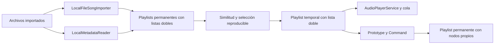

# Radio de Sonaris: biblioteca personal

El alcance definitivo es exclusivamente local. Toda canción proviene de un File importado por el usuario; no hay proveedores remotos, backend, cuentas, credenciales ni enriquecimiento online.

## Arquitectura y ciclo de vida

`LocalRadioService` recorre listas permanentes de `PlaylistService` y deduplica sus archivos. `LocalRecommendationEngine` puntúa candidatos y realiza selección ponderada sin reemplazo. `PlaylistBuilder` crea una Playlist temporal; `Song.clone` conserva fuentes y crea IDs nuevos. Su `DoublyLinkedList<Song>` es la fuente de verdad de orden, head, tail, current y size. La radio se muestra en Mis playlists y utiliza `AudioPlayerService`, la cola, historial, modos, efectos, estadísticas y temporizador existentes.

`LocalRadioView` ofrece búsqueda global con debounce de 180 ms y páginas de ocho archivos, acciones sobre la canción inicial, escucha temporal, generación automática, configuración, explicaciones y guardado. No hay resultados de catálogo de muestra.

La canción inicial es el primer nodo. Anterior/Siguiente recorren enlaces y el historial existente; eliminar un nodo actual selecciona vecino y detiene reproducción según las reglas originales. Una canción manualmente retirada no vuelve a agregarse durante esa sesión. Undo permite restaurarla de forma explícita. Al regenerar se inicia una sesión nueva y se pausa la anterior. Crear radio desde una canción temporal retiene primero su archivo para evitar revocarlo al cerrar la sesión anterior.

El guardado genera UUID y nodos nuevos, conserva referencias a archivos y el orden, y admite Undo/Redo aun después de finalizar la radio. Las originales no se modifican. La radio temporal se excluye de localStorage e IndexedDB. Finalizar purga su cola/historial, elimina solo comandos de su scope y libera fuentes. Los comandos de listas permanentes permanecen.

## Algoritmo explicable

Pesos predeterminados configurables en el constructor del motor:

| Coincidencia real | Peso |
| --- | --- |
| Artista | 5 |
| Álbum | 3 |
| Género | 4 |
| Etiqueta | 2 |
| Palabra del título, con más de dos caracteres | 1 |
| Penalización de artista ya seleccionado | 2 |

Se normalizan acentos, mayúsculas y espacios para comparar. Un dato ausente no aporta puntuación. Para cada candidato se calcula `(1 + similarityScore) / (1 + diversityWeight × selectedArtistCount)`. Se sortea proporcionalmente a esos pesos y se retira el candidato del buffer. El término base 1 permite variedad incluso sin coincidencias. Los artistas desconocidos no se tratan como un artista común.

El generador `seededRandom` usa un entero de 32 bits. La misma canción inicial, semilla numérica, orden de biblioteca, pesos y metadatos producen la misma selección. Cambiar el número varía la selección cuando hay alternativas; no garantiza que bibliotecas pequeñas produzcan siempre un orden distinto. Cada recomendación muestra los criterios que coincidieron o «Selección aleatoria de tu biblioteca». Esto es similitud de metadatos, no análisis acústico ni una relación artística certificada.

La deduplicación usa `libraryKey`: nombre de archivo, tamaño, última modificación y MIME, conservados al clonar y persistir. Evita copias de playlist y reimportaciones del mismo archivo con esas propiedades. No es un hash del contenido: archivos iguales con nombres/fechas diferentes pueden considerarse distintos, y archivos diferentes con todas esas propiedades iguales pueden agruparse. No se lee el archivo completo para hacer fingerprinting.

Los arrays de ranking y páginas son buffers transitorios; nunca son la estructura principal de reproducción. Los nodos de playlist y cola continúan siendo listas dobles reales.

## Continuidad y límites

El lote admite de 1 a 50 recomendaciones; la semilla numérica, de 0 a 4294967295. Al comenzar una canción con menos de tres nodos siguientes se añade como máximo un lote. Un Set excluye la canción inicial y todos los archivos incluidos antes, incluso si se eliminaron o escucharon. No hay bucle de solicitudes, ni reintento infinito, ni acceso de red. La biblioteca finita se agota y muestra «No encontramos más canciones relacionadas». En modo normal el audio se pausa al llegar al final. Repetir canción/playlist es una elección explícita y reutiliza nodos, no genera duplicados.

Continuidad y radio automática se pueden desactivar y se guardan como configuración local. La generación automática se aplica al pulsar Escuchar desde una tarjeta global, fuera de una playlist permanente. Reproducir una lista permanente conserva su comportamiento. Si está desactivada, las tarjetas crean escucha temporal de una sola canción; Crear radio sigue disponible manualmente.

## Metadatos y persistencia

`LocalMetadataReader` lee como máximo los primeros 2 MiB. Soporta ID3v2.3/v2.4 de texto sin compresión, cifrado ni unsynchronization, WAV LIST/INFO y comentarios Vorbis en FLAC. Lee título, artista, álbum y género. Etiquetas pueden formar parte del modelo y motor, pero no se inventan ni se extraen de todos los formatos. No decodifica portadas. Un tag inválido o formato no soportado deja el archivo reproducible con su nombre original. Duración sigue procediendo de HTMLAudioElement.

Las etiquetas se sanean y congelan; los textos se escapan antes de insertarse en HTML. Las lecturas asíncronas enriquecen también copias existentes del mismo archivo. Guardar una playlist no guarda el audio automáticamente: el panel Sin conexión requiere consentimiento. Una radio temporal debe guardarse primero. Los registros antiguos sin metadatos siguen siendo compatibles.

Consultar `LOCAL_FINAL_AUDIT.md` para resultados reales y `MANUAL_QA.md` para escucha y comprobaciones humanas pendientes.
