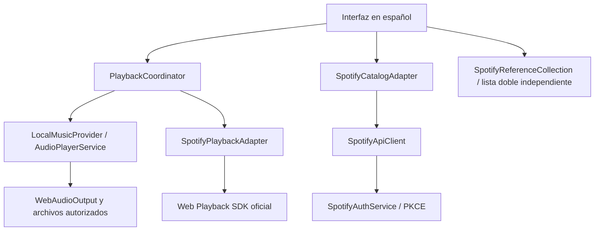

# Integración opcional de Spotify en Sonaris

El alcance vigente aprobado conserva **Mi música** y añade **Spotify** como espacio opcional. La radio, las playlists automáticas y las diez funciones avanzadas siguen funcionando exclusivamente con archivos locales. No se incorporan Jamendo, Apple Music ni YouTube. No hay backend ni dependencias de producción nuevas. No se descargan canciones de Spotify, no se usan previews y no se convierten referencias remotas en `Song` o `File`.

## Arquitectura

`MusicProvider.ts` declara referencias con identificadores compuestos y capacidades específicas. `LocalMusicProvider` adapta el reproductor y las listas existentes; el catálogo local principal conserva su buscador actual. `SpotifyIntegrationFactory` compone autenticación, cliente HTTP, catálogo, reproducción y colección. Es una factoría de composición, no una supuesta nueva implementación de Factory Method.

Cada playlist local, la cola local, las selecciones automáticas y la colección de referencias Spotify utilizan `DoublyLinkedList`, nodos reales con `previous`, `next` y `current`. Las referencias Spotify son solo de memoria, admiten deduplicación, reordenamiento y eliminación; hasta 100 referencias, diez por página. No sincronizan playlists de la cuenta. Al desconectar se borran perfil visible, resultados, referencias y tokens.

El coordinador pausa el audio local y cancela su temporizador antes de activar Spotify. Antes de permitir reproducción local espera la pausa del SDK; si no puede confirmarla o hay un inicio remoto pendiente, desconecta el dispositivo. Las respuestas tardías se invalidan por revisión. Los eventos inesperados de Spotify Connect detienen el audio local y pausan Spotify. El reproductor protegido nunca se conecta al AudioContext local. Los controles locales de transporte, efectos y temporizador se deshabilitan cuando Spotify es la fuente seleccionada; seleccionar/reproducir un archivo vuelve al espacio local.

## Operaciones oficiales utilizadas

| Método / endpoint | Finalidad |
| --- | --- |
| GET `https://accounts.spotify.com/authorize` | Consentimiento Authorization Code con PKCE S256 |
| POST `https://accounts.spotify.com/api/token` | Intercambio del código y renovación del token |
| GET `/v1/me` | Verificar sesión y nombre visible; no inferir Premium de `product` |
| GET `/v1/search?q=…&type=track\|artist\|album&limit=10&offset=…` | Búsqueda, páginas de diez, offset máximo 1000 |
| GET `/v1/artists/{id}/albums?limit=10&offset=…` | Explorar álbumes del artista |
| GET `/v1/albums/{id}` | Datos del álbum seleccionado |
| GET `/v1/albums/{id}/tracks?limit=10&offset=…` | Canciones del álbum |
| PUT `/v1/me/player/play?device_id=…` | Solicitar reproducción de una URI autorizada en el dispositivo SDK |
| `https://sdk.scdn.co/spotify-player.js` | Carga diferida del SDK después de autorización |

Pausa, reanudación, progreso, anterior/siguiente, volumen y estado provienen del SDK. Solo su estado confirma reproducción: aceptar un PUT no produce por sí mismo el mensaje «Reproduciendo». No se consultan recommendations, audio-features, audio-analysis ni endpoints masivos retirados. El diseño usa el subconjunto conservador disponible para aplicaciones nuevas en Development Mode de 2026; la migración de endpoints para aplicaciones antiguas fue aplazada y no se afirma que todas tengan idénticas restricciones.

La búsqueda tiene debounce de 350 ms, cancelación y descarte de respuestas antiguas, resultados vacíos y errores visibles. Las peticiones HTTP tienen límite de 12 segundos incluida lectura del cuerpo; el cliente limita localmente a tres concurrentes y 25 operaciones por 30 segundos. Este límite interno **no es la cuota oficial de Spotify**. Un 401 renueva una vez; un segundo invalida la sesión. Un 403 informa restricciones sin fabricar resultados. Un 429 respeta Retry-After y bloquea temporalmente nuevas operaciones. El registro del SDK y sus operaciones también tienen límites de espera.

## Capacidades y límites

| Función | Mi música | Spotify |
| --- | --- | --- |
| Reproducir, pausar, progreso, volumen | Archivos importados reales | SDK, Premium, permisos, dispositivo y navegador compatibles |
| Anterior / siguiente | Lista y cola locales | Contexto y restricciones del SDK; no una cola local simulada |
| Playlists y reordenamiento | Listas dobles, persistencia local | Colección de referencias de sesión en lista doble |
| Radio y playlists automáticas | Biblioteca importada y metadatos disponibles | No aplican |
| EQ, visualizador, fade y boost | Procesamiento Web Audio real | Deshabilitados; no se procesa audio protegido |
| Estadísticas, temporizador, atajos locales | Funcionales | No aplican; no se crean métricas de Spotify |
| Offline / PWA | Recursos propios y archivos conservados explícitamente | Sin audio ni tokens Spotify en caché |
| Reproducción sin cuenta | Sí | No |

El SDK distingue autorización, inicialización, reproducción, falta de Premium, dispositivo desconectado y bloqueo de autoplay. `activateElement` se invoca desde la acción del usuario. El volumen se deshabilita si el SDK no lo permite. La autorización puede funcionar mientras la reproducción falla por plan, navegador, DRM o restricciones de la app; la interfaz no confunde ambos estados.

## Atribución y seguridad

El logotipo completo negro oficial se conserva sin modificaciones en `src/assets/spotify-logo.svg`; procede del [paquete oficial de diseño](https://developer.spotify.com/images/guidelines/design/2024-spotify-full-logo.zip). Las portadas se muestran sin recortar ni redondear, con atribución y enlaces a Spotify. Se admiten únicamente URL HTTPS de hosts de imágenes Spotify reconocidos, sin credenciales. Los títulos se escapan antes de renderizar. No hay peticiones a Spotify al abrir la aplicación o el panel sin conectar.

Los tokens solo viven en memoria y se destruyen al desconectar, expirar o cerrar/recargar. La transacción PKCE usa sessionStorage, caduca a los diez minutos y se consume una vez. Código y state se eliminan inmediatamente de la URL de retorno. No hay Client Secret, tokens en variables VITE, logs de credenciales, extracción de audio, caché externa ni datos remotos ficticios en producción.

## Fuentes oficiales consultadas

- [PKCE](https://developer.spotify.com/documentation/web-api/tutorials/code-pkce-flow), [renovación](https://developer.spotify.com/documentation/web-api/tutorials/refreshing-tokens), [Redirect URI](https://developer.spotify.com/documentation/web-api/concepts/redirect_uri).
- [Web Playback SDK](https://developer.spotify.com/documentation/web-playback-sdk/reference), [reproductor web y permisos](https://developer.spotify.com/documentation/web-playback-sdk/howtos/web-app-player), [scopes](https://developer.spotify.com/documentation/web-api/concepts/scopes).
- [Búsqueda](https://developer.spotify.com/documentation/web-api/reference/search), [iniciar reproducción](https://developer.spotify.com/documentation/web-api/reference/start-a-users-playback), [cuotas](https://developer.spotify.com/documentation/web-api/concepts/rate-limits).
- [Cambios Development Mode 2026](https://developer.spotify.com/blog/2026-02-06-update-on-developer-access-and-platform-security), [migración de endpoints](https://developer.spotify.com/documentation/web-api/tutorials/february-2026-migration-guide).
- [Política](https://developer.spotify.com/policy), [diseño](https://developer.spotify.com/documentation/design).

La implementación y sus pruebas controladas están listas para validación con la cuenta del propietario. **No se ha verificado autorización, cuota, dispositivo ni audio real de esa cuenta.**
